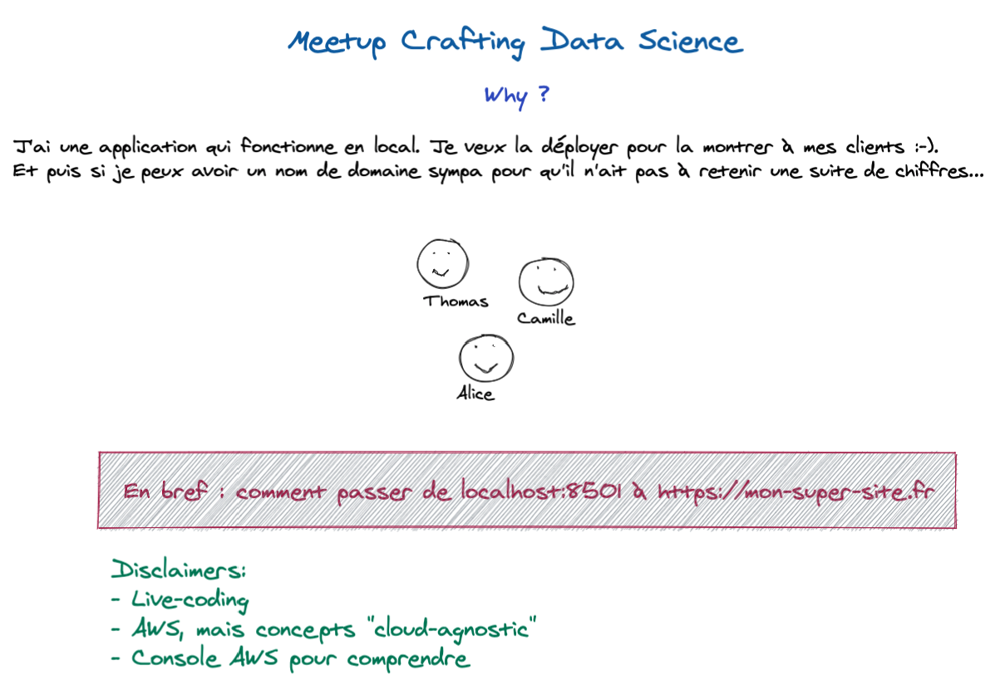
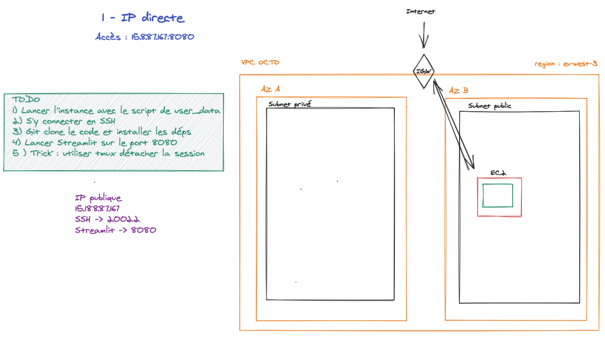
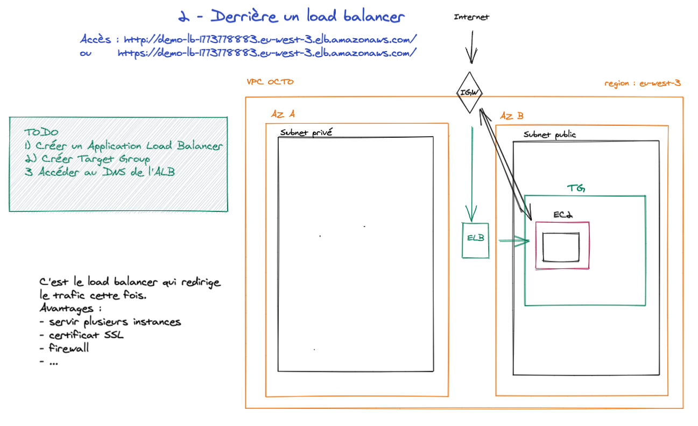
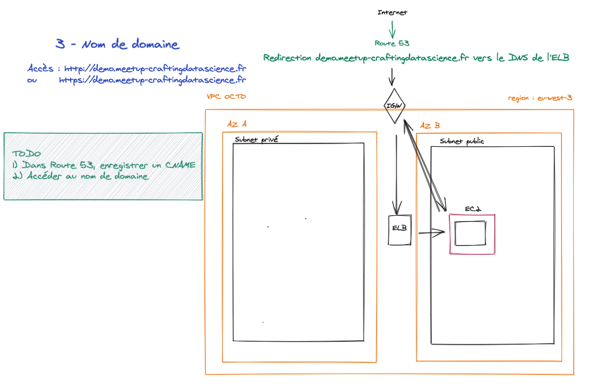
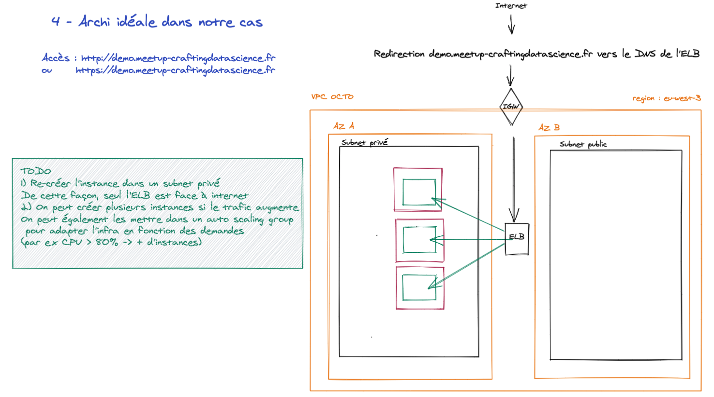
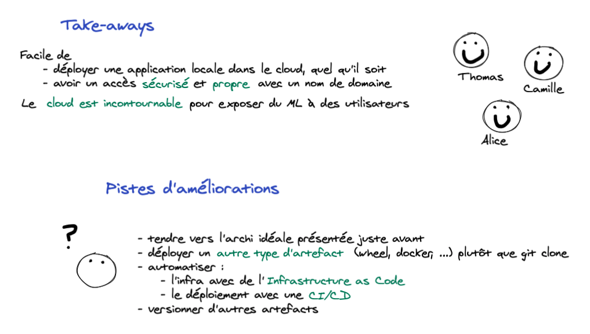

# Meetup Crafting Data Science
Ce repository est utilisé pour un talk lors du [Meetup Crafting Data Science #6](https://www.meetup.com/fr-FR/crafting-datascience/events/278093373/) du 26/05/2021.

## Schéma global
Le schéma global est le suivant : 

Sachez qu'il est également possible de télécharger le [fichier source](https://github.com/AurelienMassiot/Multi-label_text_classification/blob/master/images/meetup_crafting_ds.excalidraw) pour l'ouvrir dans [Excalidraw](https://excalidraw.com/).

## Ressources utiles

- ["Amener son projet de machine learning jusqu’en production avec Wheel et Docker"](https://blog.octo.com/amener-son-projet-de-machine-learning-jusquen-production-avec-wheel-et-docker/)
- [Setuptools : include data files](https://setuptools.readthedocs.io/en/latest/userguide/datafiles.html)
- [Deployer une application Streamlit sur EC2](https://blog.jcharistech.com/2019/10/29/how-to-deploy-streamlit-apps-on-aws-ec2/)
- [BD d'Aryana Pezé sur le Load Balancer](https://blog.octo.com/bd-le-load-balancer/)
- [AWS : Qu'est-ce qu'un Application Load Balancer ?](https://docs.aws.amazon.com/elasticloadbalancing/latest/application/introduction.html)
- [AWS : Présentation de Amazon Route 53](https://docs.aws.amazon.com/fr_fr/Route53/latest/DeveloperGuide/Welcome.html)
- [AWS : les 5 piliers du "Well-Architected Framework"](https://aws.amazon.com/fr/blogs/apn/the-5-pillars-of-the-aws-well-architected-framework/)